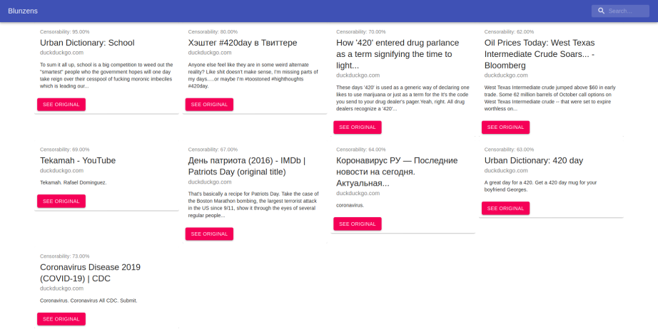

# Blunzens-show
Uncensorable speech protector on BluzelleDB.

## Acknowledgements

Created using [this](https://github.com/bcbrian/mern-template).

## Setup

Be sure to have run this code: https://github.com/uivlis/blunzens-scrap at least once before running this one.

Copy `.env.example` to `.env` and add your BLZ mnemonic.
You must also have a BLZ wallet. To create one, visit https://staking.bluzelle.com/.

## Quickstart
```sh-session
$ ./bin/run
```

## Demo

